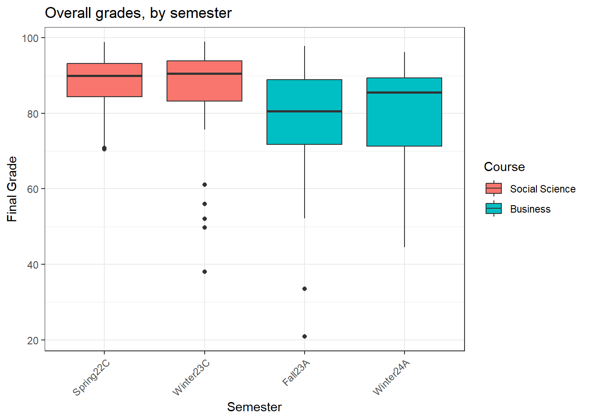
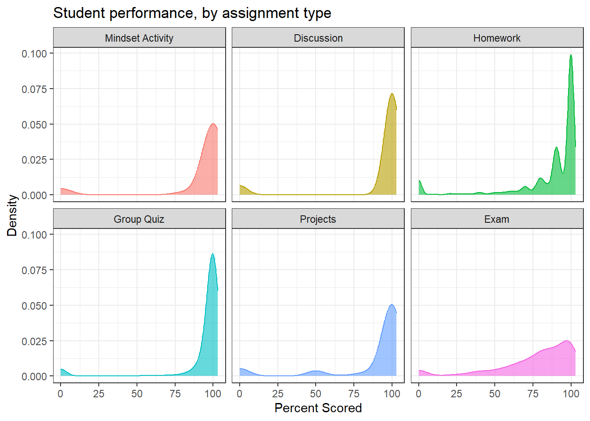
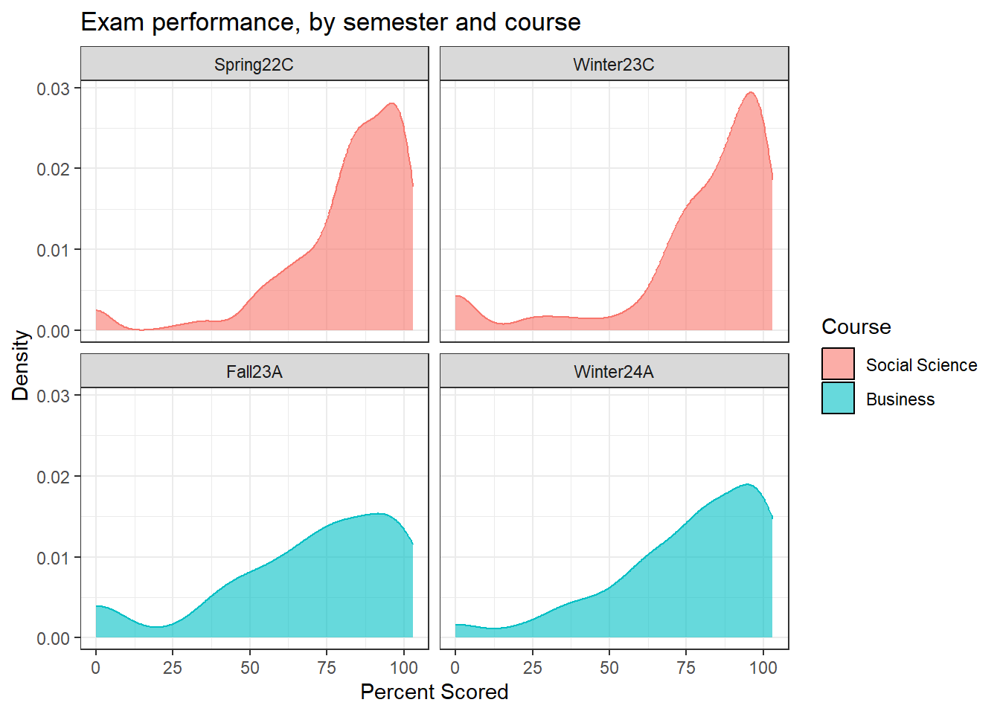
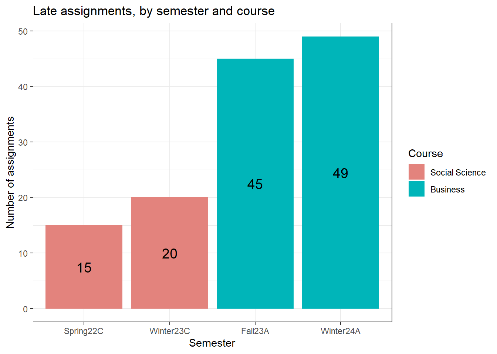
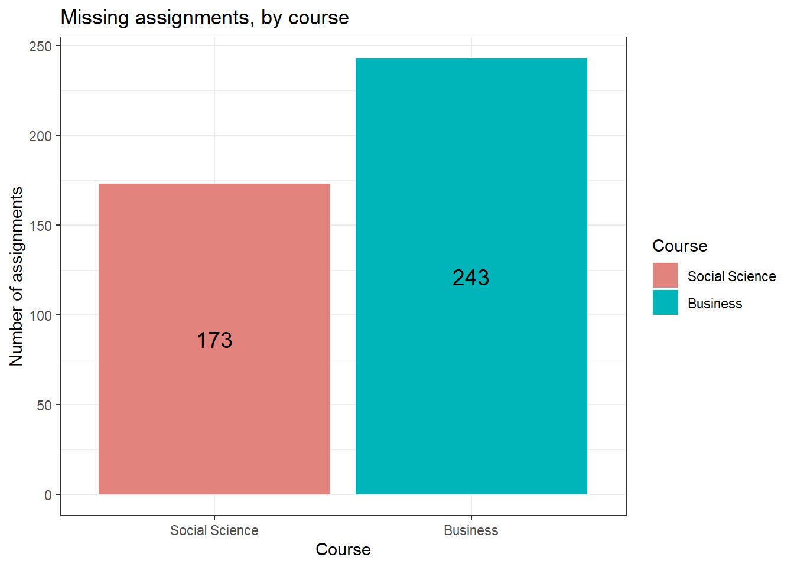

# Introduction & Data
The purpose of this assignment is to present insights into teaching MATH221 to my professor, Sister Wilkinson, who I have been a TA for since Spring 2022.

Data was collected from canvas analytics, which gives information on student activity, late / missing assignments, and student grades.

Data will be shown by course (Business Statistics, MATH221A and Social Science Statistics, MATH221C), and by semester.

Names have been removed to protect student confidentiality, and identifying data tied to students will not be included in the presentation. 


#### Reading in data

::: {.cell}

```{.r .cell-code}
w23a = read_csv("Winter23C/activity.csv")
w23c = read_csv("Winter23C/chart.csv")
w23l = read_csv("Winter23C/late.csv")
w23m = read_csv("Winter23C/missing.csv")
w23r = read_csv("Winter23C/resources.csv")
w23s = read_csv("Winter23C/students.csv")
w23g = read_csv("Winter23C/grades.csv")

w23a$semester = "Winter23C"
w23c$semester = "Winter23C"
w23l$semester = "Winter23C"
w23m$semester = "Winter23C"
w23r$semester = "Winter23C"
w23s$semester = "Winter23C"
w23g$semester = "Winter23C"


f23a = read_csv("Fall23A/activity.csv")
f23c = read_csv("Fall23A/chart.csv")
f23l = read_csv("Fall23A/late.csv")
f23m = read_csv("Fall23A/missing.csv")
f23r = read_csv("Fall23A/resources.csv")
f23s = read_csv("Fall23A/students.csv")
f23g = read_csv("Fall23A/grades.csv")


f23a$semester = "Fall23A"
f23c$semester = "Fall23A"
f23l$semester = "Fall23A"
f23m$semester = "Fall23A"
f23r$semester = "Fall23A"
f23s$semester = "Fall23A"
f23g$semester = "Fall23A"

w24a = read_csv("Winter24A/activity.csv")
w24c = read_csv("Winter24A/chart.csv")
w24l = read_csv("Winter24A/late.csv")
w24m = read_csv("Winter24A/missing.csv")
w24r = read_csv("Winter24A/resources.csv")
w24s = read_csv("Winter24A/students.csv")
w24g = read_csv("Winter24A/grades.csv")


w24a$semester = "Winter24A"
w24c$semester = "Winter24A"
w24l$semester = "Winter24A"
w24m$semester = "Winter24A"
w24r$semester = "Winter24A"
w24s$semester = "Winter24A"
w24g$semester = "Winter24A"

s22a = read_csv("Spring22C/activity.csv")
s22c = read_csv("Spring22C/chart.csv")
s22l = read_csv("Spring22C/late.csv")
s22m = read_csv("Spring22C/missing.csv")
s22r = read_csv("Spring22C/resources.csv")
s22s = read_csv("Spring22C/students.csv")
s22g = read_csv("Spring22C/grades.csv")


s22a$semester = "Spring22C"
s22c$semester = "Spring22C"
s22l$semester = "Spring22C"
s22m$semester = "Spring22C"
s22r$semester = "Spring22C"
s22s$semester = "Spring22C"
s22g$semester = "Spring22C"
```
:::


#### Wrangling (combining dataframes, selecting and renaming columns, basic filtering)

::: {.cell}

```{.r .cell-code}
colnames(w23g) = gsub("\\s*\\(\\d+\\)\\s*", "", colnames(w23g))
colnames(f23g) = gsub("\\s*\\(\\d+\\)\\s*", "", colnames(f23g))
colnames(w24g) = gsub("\\s*\\(\\d+\\)\\s*", "", colnames(w24g))
colnames(s22g) = gsub("\\s*\\(\\d+\\)\\s*", "", colnames(s22g))


unposted_cols = grep("Unposted", colnames(w23g))
w23g = w23g %>% subset(select = -unposted_cols)

unposted_cols = grep("Unposted", colnames(f23g))
f23g = f23g %>% subset(select = -unposted_cols)

unposted_cols = grep("Unposted", colnames(w24g))
w24g = w24g %>% subset(select = -unposted_cols)

unposted_cols = grep("Unposted", colnames(s22g))
s22g = s22g %>% subset(select = -unposted_cols)


unposted_cols = grep("Survey", colnames(w23g))
w23g = w23g %>% subset(select = -unposted_cols)

unposted_cols = grep("Survey", colnames(f23g))
f23g = f23g %>% subset(select = -unposted_cols)

unposted_cols = grep("Survey", colnames(w24g))
w24g = w24g %>% subset(select = -unposted_cols)

unposted_cols = grep("Survey", colnames(s22g))
s22g = s22g %>% subset(select = -unposted_cols)


unposted_cols = grep("Imported", colnames(w23g))
w23g = w23g %>% subset(select = -unposted_cols)

unposted_cols = grep("Imported", colnames(w24g))
w24g = w24g %>% subset(select = -unposted_cols)

unposted_cols = grep("Imported", colnames(s22g))
s22g = s22g %>% subset(select = -unposted_cols)

w24g = w24g %>% select(-`W09: Mid-course check-in`)


colnames(f23g) = colnames(w24g)
colnames(s22g) = colnames(w24g)
colnames(w23g) = colnames(w24g)


activity = rbind(w23a, f23a, w24a, s22a)
chart = rbind(w23c, f23c, w24c, s22c)
late = rbind(w23l, f23l, w24l, s22l)
missing = rbind(w23m, f23m, w24m, s22m)
resources = rbind(w23r, f23r, w24r, s22r)
students = rbind(w23s, f23s, w24s, s22s)
grades = rbind(w23g, f23g, w24g, s22g)

activity = activity %>% select(-`Student Name`, -`Sortable Name`, -`Section Name`, -`Course Id`, -`Section Id`)
new_colnames = tolower(gsub(" ", "_", colnames(activity)))
colnames(activity) = new_colnames


chart = chart %>% select(-`Filter`)
new_colnames = tolower(gsub(" ", "_", colnames(chart)))
colnames(chart) = new_colnames


late = late %>% select(-`Student Name`, -`Unlocked Date`, -`Graded Date`, -`Posted Date`, -`Course ID`, -`Section Name`)
new_colnames = tolower(gsub(" ", "_", colnames(late)))
colnames(late) = new_colnames


missing = missing %>% select(-`Student Name`, -`Unlocked Date`, -`Course ID`, -`Section Name`)
new_colnames = tolower(gsub(" ", "_", colnames(missing)))
colnames(missing) = new_colnames


students = students %>% select(-`Full name`, -`Sortable name`, -`Email`)
new_colnames = tolower(gsub(" ", "_", colnames(students)))
colnames(students) = new_colnames

new_colnames = tolower(gsub(" ", "_", colnames(resources)))
colnames(resources) = new_colnames


grades = grades %>% select(-`Student`, -`SIS Login ID`, -`Section`, -`Current Grade`,-`Final Grade`)
new_colnames = tolower(gsub(" ", "_", colnames(grades)))
colnames(grades) = new_colnames
grades[1, 1] = -1

activity = activity %>% filter(content_type != "course.files.file")
chart = chart %>% filter (page_views > 0)
```
:::


#### Sample of wrangled dataframes (showing late assignments dataframe)

::: {.cell}

```{.r .cell-code}
ex = late %>% select(-`due_date`, -`submitted_date`, -`course_name`)
ex$student_id = "2****"
ex %>% head(5) %>% pander()
```

::: {.cell-output-display}
-------------------------------------------------------------------------
 student_id         assignment_name          points_possible   semester  
------------ ------------------------------ ----------------- -----------
   2****      L07 Quiz: Practice Proctored          3          Winter23C 
               Exam (Remotely Proctored)                                 

   2****       Final Project: Design the           25          Winter23C 
                         Study                                           

   2****           L03 Quiz: Homework              13          Winter23C 

   2****      L07 Quiz: Practice Proctored          3          Winter23C 
               Exam (Remotely Proctored)                                 

   2****       Final Project: Design the           25          Winter23C 
                         Study                                           
-------------------------------------------------------------------------
:::
:::


# Analysis

#### Grades Pivot

::: {.cell}

```{.r .cell-code}
grades = grades %>%
  mutate_if(names(.) != "id" & names(.) != "semester", as.double)
grades_long = grades %>%
  pivot_longer(cols = -c(id, semester), names_to = "assessment_type", values_to = "grade")


possible = grades_long %>% 
  filter(id == -1) %>% select(semester, assessment_type, grade)

possible[82:93, 3] = 100

pw23 = possible
pf = possible
pw24 = possible
ps = possible

pw23$semester = "Winter23C"
pf$semester = "Fall23A"
pw24$semester = "Winter24A"
ps$semester = "Spring22C"

possible = rbind(pw23, pf, pw24, ps)

grades = grades_long %>%
  left_join(possible, by = c("semester", "assessment_type")) %>%
  mutate(percent_scored = round((grade.x / grade.y)*100,2)) %>%
  select(-grade.y)


grades = grades %>% filter(id != -1)
grades = grades %>%
  mutate(
    type = case_when(
    grepl("exam", assessment_type, ignore.case = TRUE) ~ "Exam",
    grepl("homework", assessment_type, ignore.case = TRUE) ~ "Homework",
    grepl("quiz", assessment_type, ignore.case = TRUE) ~ "Group Quiz",
    grepl("mindset_activity", assessment_type, ignore.case = TRUE) ~ "Mindset Activity",
    grepl("discussion", assessment_type, ignore.case = TRUE) ~ "Discussion",
    grepl("book_of_mormon_project", assessment_type, ignore.case = TRUE) ~ "Projects",
    grepl("final_project", assessment_type, ignore.case = TRUE) ~ "Projects",
    TRUE ~ NA_character_
  ))
```
:::


## Performance

::: {.cell}

```{.r .cell-code}
students$semester <- factor(students$semester, levels = c("Spring22C", "Winter23C", "Fall23A", "Winter24A"))

students = students %>%
  mutate(
    Course = case_when(
    grepl("C", semester, ignore.case = FALSE) ~ "Social Science",
    grepl("A", semester, ignore.case = FALSE) ~ "Business",
    TRUE ~ NA_character_
  ))


students$Course <- factor(students$Course, levels = c("Social Science", "Business"))


ggplot(students, aes(x=semester, y=overall_course_grade, fill=Course)) + 
  geom_boxplot() +
  theme_bw() +
  theme(axis.text.x = element_text(angle = 45, hjust = 1)) +
  labs(x = "Semester", y = "Final Grade", title = "Overall grades, by semester")
```

::: {.cell-output-display}
{width=672}
:::
:::

::: {.cell}

```{.r .cell-code}
tb = favstats(overall_course_grade ~ semester, data = students)
tb %>% select("Semester" = semester, "Min" = "min", Q1, "Median" = "median", "Max" = "max") %>% pander()
```

::: {.cell-output-display}
--------------------------------------------
 Semester     Min     Q1     Median    Max  
----------- ------- ------- -------- -------
 Spring22C   70.49   84.35   89.96    98.91 

 Winter23C   38.08   83.28   90.51    98.95 

  Fall23A    20.91   71.75   80.55    97.85 

 Winter24A   44.48   71.26   85.52    96.21 
--------------------------------------------
:::
:::

In 2023, Sister Wilkinson was changed from teaching Social Science Statistics (MATH221C) to Business Statistics (MATH221A). We see a clear difference in the kinds of grades that students achieve between the courses. There is virtually no difference in the material between 221A and 221C, however they are offered with different names to fulfill degree requirements. Different student demographics take these courses and cause this discrepancy. 

Between the sections, we see similar maximum highs, but Business Statistics has a whole letter grade lower median and a much wider spread into failing grades.


::: {.cell}

```{.r .cell-code}
grades1 = subset(grades, !grepl("score", assessment_type, ignore.case = TRUE))
grades1 = grades1 %>% filter(!is.na(type))

grades1$type <- factor(grades1$type, levels = c("Mindset Activity", "Discussion", "Homework", "Group Quiz", "Projects", "Exam"))

ggplot(grades1, aes(x = percent_scored, fill = type, color = type)) +
  geom_density(alpha = 0.6) +
  facet_wrap(~ type) +
  labs(title = "Student performance, by assignment type", x = "Percent Scored", y = "Density") +
 guides(fill = FALSE, color = FALSE)+
  theme_bw()
```

::: {.cell-output-display}
{width=672}
:::
:::

::: {.cell}

```{.r .cell-code}
tb = favstats(percent_scored ~ type, data = grades1)
tb %>% select("Type" = type, Q1,"Average" = "mean", "Median" = "median", Q3) %>% pander()
```

::: {.cell-output-display}
-----------------------------------------------------
       Type          Q1     Average   Median    Q3   
------------------ ------- --------- -------- -------
 Mindset Activity    100     91.59     100      100  

    Discussion       100     91.6      100      100  

     Homework       84.62    85.9      100      100  

    Group Quiz       100     93.32     100      100  

     Projects        100     87.6      100      100  

       Exam         66.67    76.3     83.33    96.24 
-----------------------------------------------------
:::
:::


Here is a breakdown of grades by the different categories of assignments to hopefully we can see why some students struggle to do well. Minimums were 0 and maximums were 100. We see a 'bump' in the distributions of outliers who scored a 0, and an interesting bump in project scores of 50%.

Students get a passing grade in most assignments where it is group work. However on individual assignments such as homework and especially exams, we see a much greater spread of grades and likely a better picture of student comprehension of the material. Exams are worth 50% of students' grades, this is definitely the cause of the struggling we were seeing earlier.


::: {.cell}

```{.r .cell-code}
grades2 = grades1 %>% filter(type == "Exam")
grades2$semester <- factor(grades2$semester, levels = c("Spring22C", "Winter23C", "Fall23A", "Winter24A"))

grades2 = grades2 %>%
  mutate(
    Course = case_when(
    grepl("C", semester, ignore.case = FALSE) ~ "Social Science",
    grepl("A", semester, ignore.case = FALSE) ~ "Business",
    TRUE ~ NA_character_
  ))

grades2$Course <- factor(grades2$Course, levels = c("Social Science", "Business"))

ggplot(grades2, aes(x = percent_scored, fill = Course, color = Course)) +
  geom_density(alpha = 0.6) +
  facet_wrap(~ semester) +
  labs(title = "Exam performance, by semester and course", x = "Percent Scored", y = "Density") +
 guides(color = FALSE)+
  theme_bw()
```

::: {.cell-output-display}
{width=672}
:::
:::

::: {.cell}

```{.r .cell-code}
tb = favstats(percent_scored ~ Course, data = grades2)
tb %>% select("Course" = Course, Q1,"Average" = "mean", "Median" = "median", Q3) %>% pander()
```

::: {.cell-output-display}
---------------------------------------------------
     Course        Q1     Average   Median    Q3   
---------------- ------- --------- -------- -------
 Social Science   73.73     80      87.14    96.75 

    Business      58.13    71.9     78.58    94.31 
---------------------------------------------------
:::
:::


Diving into exam scores, it's apparent the reason why 221C has better overall scores than 221A, they have better exam scores. Will late or missing assignments reveal a difference in effort to learn course material? Are their participation levels comparable?


## Participation

::: {.cell}

```{.r .cell-code}
chart = chart %>% mutate(week_start = mdy(week_start))
min_dates = chart %>% group_by(semester) %>% summarise(min_date = min(week_start))
chart = chart %>% left_join(min_dates, by = "semester")
chart = chart %>% mutate(week = as.numeric((week_start - min_date) / 7)+1)


chart$Semester <- factor(chart$semester, levels = c("Spring22C", "Winter23C", "Fall23A", "Winter24A"))

chart = chart %>% filter(week<17)


chart = chart %>%
  mutate(
    Course = case_when(
    grepl("C", semester, ignore.case = FALSE) ~ "Social Science",
    grepl("A", semester, ignore.case = FALSE) ~ "Business",
    TRUE ~ NA_character_
  ))


chart$Course <- factor(chart$Course, levels = c("Social Science", "Business"))


ggplot(chart, aes(x = week, y = avg_page_views, group = Semester, color = Semester, shape = Course)) +
  geom_point(size = 3)+
  geom_line(size = .7) +
  labs(title = "Course participation, by semester", x = "Week", y = "Average Views")+ 
  scale_x_continuous(breaks = seq(min(chart$week), max(chart$week), by = 2)) +
  theme_bw()
```

::: {.cell-output-display}
{width=672}
:::
:::

This chart tells a story of students winding up in the semester, with peaks near exams as they dedicate extra time to prepare, and winding back down as the semester ends.

Looking at average page views, there is a clear distinction in the level of class interaction happening between the courses. High average page views shows that lots of students are getting on daily to study and complete prep and graded assignments. There is less average page views with the business students.


## Late & Missing Assignments


::: {.cell}

```{.r .cell-code}
lagg = late %>% group_by(semester) %>% summarise(count = n())
lagg$Semester <- factor(lagg$semester, levels = c("Spring22C", "Winter23C", "Fall23A", "Winter24A"))
lagg = lagg %>%
  mutate(
    Course = case_when(
    grepl("C", semester, ignore.case = FALSE) ~ "Social Science",
    grepl("A", semester, ignore.case = FALSE) ~ "Business",
    TRUE ~ NA_character_
  ))


lagg$Course = factor(lagg$Course, levels = c("Social Science", "Business"))


ggplot(lagg, aes(x=Semester, y = count, group = Course, fill=Course)) + 
  geom_col( ) +
  geom_text(aes(label = count), 
            position = position_stack(vjust = 0.5), 
            size = 5, 
            color = "black", 
            show.legend = FALSE) + 
  scale_fill_hue(c = 70) + 
  labs(y = "Number of assignments", title = "Late assignments, by semester and course") +
  theme_bw()
```

::: {.cell-output-display}
{width=672}
:::
:::

MATH221C students turned in less than half of the late assignments than MATH221A students did. A pattern of not showing effort is starting to show for the business students. Let's see about missing assignments.


::: {.cell}

```{.r .cell-code}
missing = missing %>%
  mutate(
    Course = case_when(
    grepl("C", semester, ignore.case = FALSE) ~ "Social Science",
    grepl("A", semester, ignore.case = FALSE) ~ "Business",
    TRUE ~ NA_character_
  ))

maggc = missing %>% group_by(Course) %>% summarise(count = n())

maggc$Course = factor(maggc$Course, levels = c("Social Science", "Business"))

ggplot(maggc, aes(x=Course, y = count, group = Course, fill=Course)) + 
  geom_col( ) +
  geom_text(aes(label = count), 
            position = position_stack(vjust = 0.5), 
            size = 5, 
            color = "black", 
            show.legend = FALSE) + 
  scale_fill_hue(c = 70) + 
  labs(y = "Number of assignments", title = "Missing assignments, by course") +
  theme_bw()
```

::: {.cell-output-display}
{width=672}
:::
:::

Missing assignments are a similar case to late assignments. Once again, business students fall behind compared to social science. There isn't much of a real excuse for students missing assignments besides lack of trying. Sister Wilkinson is very lenient with all assignments and works with students to be flexible on turning things in.


# Conclusions
To help students achieve better grades, and hopefully increase actual understanding, I recommend we find ways to drive up participation. There is a clear trend between the amount that a class cohort put in effort by participating and their overall grades. This could be done in many ways.
Group work is good for this class as there is a large spread in performance, and having students who are comfortable getting through the material help students who are not is mutually beneficial. However, one way we could help is that we could shift some assignments to be done individually. That way students could better gauge their level of understanding and not be surprised by exams.


